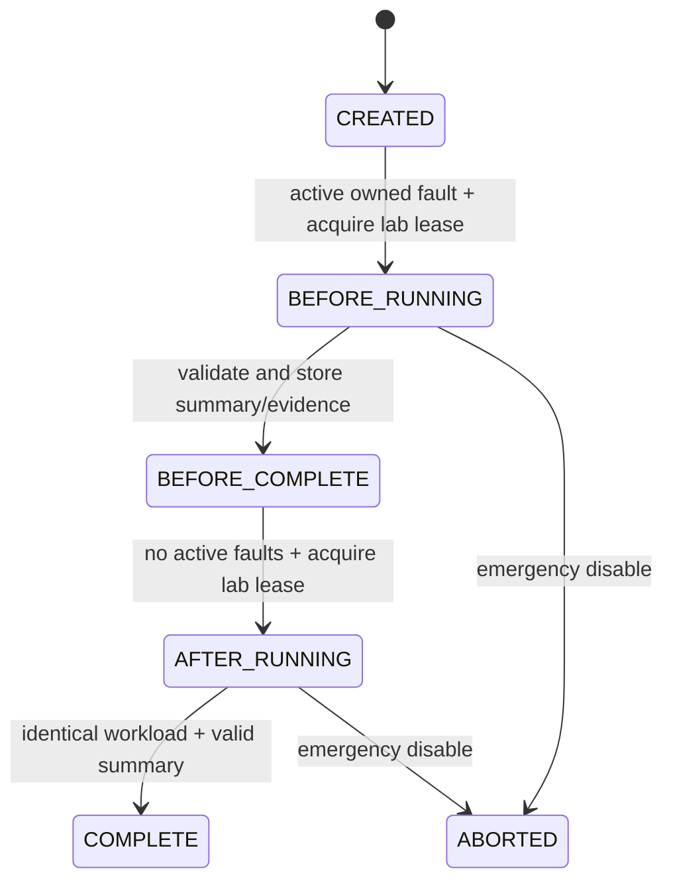

# Architecture and invariants

## Boundaries

`control-plane` owns incident sessions, activation audit, evidence, RCA and experiments. It can diagnose the workload without participating in order transactions. `demo-api` owns catalog/order acceptance and the outbox. `demo-worker` owns fulfillment/deduplication. `libs/common` supplies wire records, scoped telemetry, context propagation, safe errors and small-body middleware.

MySQL hosts `control_plane`, `demo_api`, `demo_worker`. Local Compose uses one app credential for convenience; logical ownership is enforced in code, not by production-grade grants. Redis and Kafka are shared infrastructure. Services never query another service's domain database.

## Consistency contract

```mermaid
sequenceDiagram
    participant C as Client
    participant A as demo-api
    participant D as API MySQL
    participant R as Relay
    participant K as Kafka
    participant W as Worker
    participant F as Worker MySQL
    C->>A: POST order + Idempotency-Key
    A->>D: BEGIN; upsert order; insert outbox
    D-->>A: COMMIT
    A-->>C: 201 created / 200 replay
    R->>D: Claim due row under lock; COMMIT lease
    R->>K: Publish order-created, key=orderId
    K-->>R: Broker acknowledgement
    R->>D: Mark published only if lease token matches
    K->>W: Deliver (duplicates possible)
    W->>F: BEGIN; dedup event; fulfill order
    F-->>W: COMMIT
    W-->>K: Commit consumed offset
```

Order acceptance is strongly consistent within the API database. Fulfillment is eventually consistent across Kafka. The HTTP response does not assert that fulfillment has happened. An atomic worker DB transaction gives the idempotent business effect; offset commits and DB commits are not a distributed transaction.

| Failure boundary | Result and recovery |
|---|---|
| Before order transaction commits | Neither order nor outbox intent survives |
| DB committed, broker unavailable | Order remains accepted; due outbox row retries with bounded exponential delay |
| Relay crashes while holding lease | Lease expires; another relay can claim the row |
| Kafka accepted, relay failed before marking published | Event may be sent again; same event ID protects fulfillment |
| Worker commits DB then crashes before offset commit | Kafka redelivers; unique event/order records prevent repeated effect |
| Event reuses identity with different business payload | Rejected; bounded/non-retryable recovery routes bad data to DLQ |
| DLQ send fails | Source offset must not be considered recovered; the recoverer throws |

Outbox claims use `FOR UPDATE SKIP LOCKED`, a unique fencing token and a 15-second lease. A Kafka send waits up to five seconds. Retried sends may outlive a caller timeout; idempotency still protects the business result. The relay never holds the claim transaction while waiting on Kafka. Retries use 2, 4, 8… seconds, capped at 60; persistent failures remain inspectable rather than discarded. There is no strict ordering guarantee for different outstanding events of a future multi-event aggregate; this demo emits one creation event per order.

## Important tables and indexes

| Database/table | Constraint or index | Reason |
|---|---|---|
| `demo_api.purchase_order` | unique, ASCII binary `idempotency_key` | Final race protection and case-sensitive replay semantics |
| `demo_api.product` | `(category,id)` | Normal category filter plus ordered limit |
| `demo_api.product_detail` | primary key `product_id` | Indexed join/detail lookup |
| `demo_api.outbox_event` | `(published_at,next_attempt_at,created_at)` | Find due unpublished work; lease token fences completion |
| `demo_worker.processed_event` | primary key `event_id` | Event-level duplicate protection |
| `demo_worker.fulfillment` | primary key `order_id`, unique `event_id` | Business-level duplicate protection even with a new event ID |
| `control_plane.evidence` | `(session_id,window_end)` | Retrieve incident evidence without scanning all sessions |
| `control_plane.experiment` | unique `session_id` | One experiment per telemetry scope; avoid histogram contamination |
| `control_plane.lab_lock` | singleton primary key, pessimistic row lock | Serialize controlled runs and fault changes |

Flyway owns DDL; Hibernate validates it. SQL constraints protect identities, references and valid quantities. The seeded catalog contains 10,000 deterministic products, with four categories and corresponding details. No SQL delay function masquerades as a database-performance problem.

## Redis contract

| Key | Value / TTL | Behavior |
|---|---|---|
| `incidentlens:catalog:v1:<category>` | serialized catalog page, random 25–35 seconds | Cache-aside; local per-category locking and double-check reduce duplicate fills |
| `incidentlens:fault` | session/scenario/parameter/expiry JSON, 900 seconds | Lua compare-owner operation prevents another session overwriting an active fault |

The catalog is immutable in this demo, so there is no write invalidation protocol. No stale cache value is deliberately served after expiry. Redis failure disables fault injection and routes catalog reads through a bounded local lock to MySQL; requests can fail with overload/timeouts. The cache lock is process-local: multiple API replicas require a different coordination policy. LRU eviction can remove the fault key early; this safely removes a fault and invalidates a BEFORE run rather than extending it.

Fault application and SQL audit cannot commit atomically. The activation API acknowledges success only after both complete, but a crash can leave Redis applied without the audit row. Actual state is read from Redis; `incident_session.status` describes the last recorded command, not proof of live activation. The 15-minute TTL and explicit disable bound that gap. The test laboratory accepts this tradeoff; a production control system should use a durable desired-state reconciler.

## Kafka contract

- Main topic: `incidentlens.orders.v1`; DLQ: `incidentlens.orders.v1.dlq`; three partitions each, replication factor one locally.
- Key: order UUID. Consumer group: `incidentlens-fulfillment-v1`; concurrency three by default.
- JSON event: schema version, event/order/product IDs, quantity, incident/phase, correlation, W3C parent and creation time. Validate required fields before processing.
- Additive optional fields can be compatible; incompatible semantic changes require a new schema/version and rollout plan.
- Auto-commit disabled; record acknowledgement follows successful processing. Transient failures receive three bounded exponential retries (200, 400, 800 ms); invalid business messages do not benefit from retry.
- Failed recovery publication throws. DLQ records preserve original metadata; replay is an explicit operator activity, not an automatic endless loop.
- Lag measures log end minus committed offsets across the consumer group's partitions. It is a sampled shared gauge, not a per-session count or a throughput measurement.

## Experiments and measurement



A run lease lasts configured duration plus 180 seconds. An expired run cannot accept late completion or overwrite a later owner's lock. A scheduled reconciliation marks expired owners ABORTED and releases their leases. One experiment per session and a no-prior-observations check at run start keep phase samples independent. A retry after interruption uses a new session/experiment. External traffic is not prevented; header scoping excludes unrelated request histograms but not system-wide queue gauges.

k6 counts only the catalog/order workload. Its p50/p95/p99 are milliseconds across the combined request population; throughput uses actual elapsed test seconds. API summaries derive success and throughput from counts, reject impossible errors/percentiles and enforce the saved VU/duration settings. The local API trusts the operator's submitted load-generator measurements; cryptographic result attestation is outside scope.

Service telemetry keeps at most 128 session/phase scopes and 8,192 duration samples per scope. Percentiles are nearest-rank over retained samples, not averaged per-instance p95s. Snapshot collection persists provenance and collection gaps. Evidence values are scoped; shared gauges explicitly say so. Each RCA uses the newest BEFORE evidence per service/type, never silently mixes in AFTER. Existing report citations remain visible even when the normal latest-500 evidence page would omit them.

## Observability and safety

Prometheus is the aggregate metrics store. OTel Collector routes spans/logs to Tempo/Loki. Direct scoped evidence makes the core product work without that optional stack. The Java agent does automatic HTTP/JDBC/Redis/Kafka instrumentation; explicit W3C capture/restore bridges the DB outbox. Without an agent, trace references remain absent.

Low-cardinality service/result tags are used for metrics. Incident IDs belong in evidence/logs/traces, not unbounded Prometheus labels. Logging avoids request bodies, credentials, and LLM response text. JSON request bodies are bounded at 32 KiB, including chunked input. Validation, parameterized SQL, safe RFC7807 errors, explicit timeouts and localhost-only published ports are baseline safeguards. No application authentication is claimed.

Read the [ADRs](docs/adr/001-service-boundaries.md), [backend implementation notes](docs/DEMO_BACKEND.md) and [operations guide](docs/OPERATIONS.md) for implementation details and limitations.
