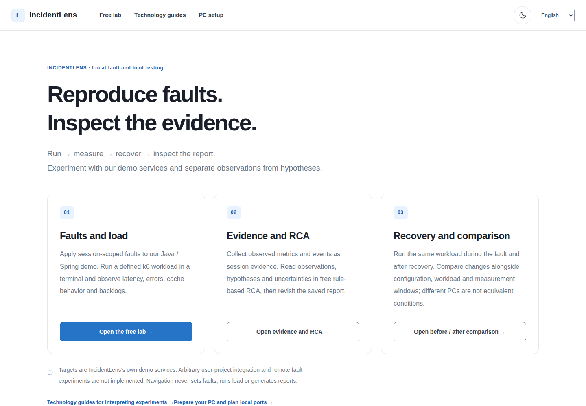
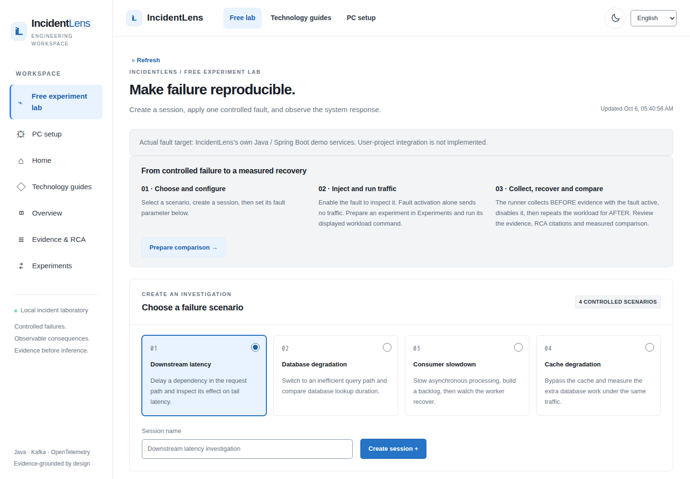
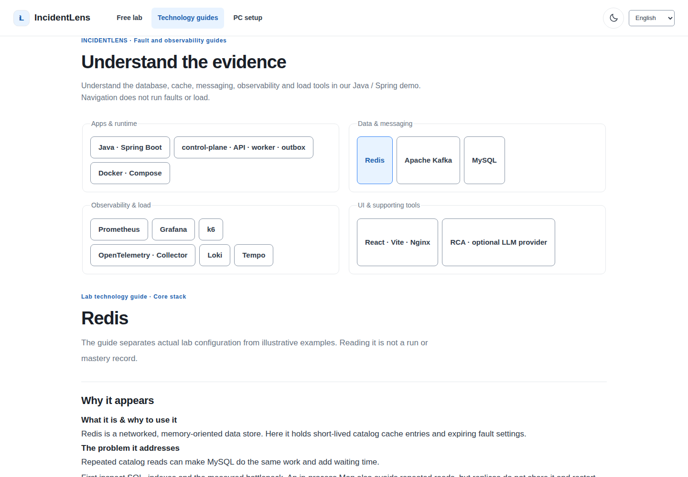

# IncidentLens

[한국어](README.md) · [English](README.en.md)

A local tool for **backend fault reproduction, load testing, observability, before/after comparison and evidence-based root-cause analysis**. Apply a fault to a session, measure changes under a defined workload, disable it and compare recovery. Free rule-based RCA saves reports that separate observations, hypotheses and uncertainty.

Targets are currently **the Java / Spring Boot demo services in this repository**. Arbitrary user-project discovery, connection and automatic analysis are not implemented. User-project integration is a future plan, outside this split. Remote fault experiments are unsupported.





These are new English browser captures from this source. The Korean document uses separate Korean captures. All are 1440×1000, light theme. Screens illustrate the interface, not performance or production results. Saved sessions shown are actual local verification records; no example measurements were inserted.

## Fault injection versus load testing

**Fault injection** configures delay or bypass in a session's request/processing path. **Load testing** uses k6 to send actual requests for a chosen user count and duration. Setting a fault does not start load. Navigation never runs experiments.

| Scenario | Actual demo behavior | Relevant evidence |
|---|---|---|
| `DOWNSTREAM_LATENCY` | Delay the simulated inventory check in the order path | HTTP latency/errors and related events |
| `DATABASE_DEGRADATION` | Use an inefficient catalog DB-query path | DB operations/query p95 and HTTP latency |
| `CACHE_DEGRADATION` | Bypass Redis catalog caching and request coalescing | Cache hit rate, DB operations and HTTP latency |
| `KAFKA_SLOWDOWN` | Delay worker handling before its database transaction | Consumer lag, processing latency and backlog |

The tool does not destroy network infrastructure or actual database/Kafka processes. Fault ownership and request headers restrict experiments to a session, only one fault can be active, and it expires after 15 minutes. The UI shows an active-fault warning and explicit disable/return actions. See [actual demo failure boundaries](docs/DEMO_BACKEND.md).

## Run → measure → recover → inspect the report

1. Check local service health. Create a session for a chosen scenario in the free lab or select an existing session.
2. Explicitly set the fault and send requests. Collect evidence for the chosen BEFORE/AFTER window. Use the terminal runner below for an automatic comparison.
3. The runner verifies a matched local target and idle telemetry, applies the fault, runs BEFORE load and saves evidence/rule-based RCA. It disables the fault and repeats the same load in AFTER. BEFORE means the **fault-active interval**, not a healthy baseline.
4. Inspect saved evidence/RCA and comparisons. Reload to fetch the same session again. Failed runs are not presented as completed benchmarks.

```bash
VUS=2 DURATION_SECONDS=10 bash scripts/demo-compare.sh --scenario CACHE_DEGRADATION
```

```powershell
.\scripts\demo-compare.ps1 -Scenario CACHE_DEGRADATION -Vus 2 -DurationSeconds 10
```

Bash requires Docker, `curl` and `jq`. k6 runs in a one-off Compose container. Summary JSON stays in ignored local `artifacts/`; sessions, evidence and reports persist in the database. On failure/interruption the runner rechecks the original local instance and attempts cleanup. If cleanup fails, inspect that session manually. Stop a runner with Ctrl+C and verify no active fault remains.

## Local execution

Use Git, a local Docker Engine/Desktop and Docker Compose. `.env.example` contains local demo defaults. Rule-based RCA requires no account or paid LLM key. Preserve an existing `.env`. Check existing-container impact before installing tools, changing administrator/security settings or restarting Docker.

From the repository root:

```bash
bash scripts/dev-up.sh
bash scripts/dev-status.sh
```

```powershell
.\scripts\dev-up.ps1
.\scripts\dev-status.ps1
```

Default web: **http://127.0.0.1:3000**; API documentation: **http://127.0.0.1:8080/swagger-ui/index.html**. If ports changed, use the actual addresses printed by `dev-status`. Core has seven services: web, control-plane, demo-api, demo-worker, MySQL, Redis and Kafka. `bash scripts/dev-up.sh --observability` or `.\scripts\dev-up.ps1 -Observability` adds Prometheus, Grafana, Loki, Tempo and OpenTelemetry Collector. Initial downloads/builds take additional time.

## PC-specific execution setup

`?view=settings` stores only a **browser plan** for shell, ports and workload. It does not apply Docker or `.env` changes. The browser cannot inspect Docker/WSL readiness, reserved ports, RAM or disk; use actual terminal output. See [readiness commands, resources and application steps](docs/PC_SETUP.md).

| Mode | Capabilities and limits |
|---|---|
| UI only | Node.js 22.x starting at 22.12, or 24+, and a web development server. Read home/interface/guides; no API connection, faults, evidence, RCA or comparison |
| Core lab | Seven services: demo faults, in-process telemetry, rule RCA and terminal k6 comparison |
| With observability | Core plus five tools for metrics, logs and traces; extra resources/preparation |

UI-only commands: `cd apps/web`, `npm ci`, `npm run dev -- --host 127.0.0.1 --port 5173 --mode ui`. Legacy `--mode learning` remains an API-blocking compatibility alias; it does not provide the removed courses.

| Variable | Default host port | Fixed container port |
|---|---:|---:|
| `CONTROL_PLANE_PORT` | 8080 | 8080 |
| `DEMO_API_PORT` | 8081 | 8081 |
| `DEMO_WORKER_PORT` | 8082 | 8082 |
| `WEB_PORT` | 3000 | 8080 |
| `PROMETHEUS_PORT` | 9090 | 9090 |
| `GRAFANA_PORT` | 3001 | 3000 |

Bindings use `127.0.0.1`. Choose free host ports in `.env` instead of killing existing processes. Internal service ports stay unchanged. Vite reads the same root `.env` `CONTROL_PLANE_PORT`. Changed environment, ports or profiles require `dev-up` to recreate affected containers; `restart` alone does not read new `.env` values.

Fixed memory limits sum to 3.75 GiB core or 6.25 GiB with observability. These are neither measured use nor minimum requirements. Allow extra room for the OS, Docker, builds and other containers. No verified low-spec success/minimum RAM is claimed. Default load is 2 VUs for 10 seconds per phase; supported bounds are 1–50 VUs and 5–300 seconds, not a capacity guarantee. Start small and inspect `docker stats`, errors and backlog.

## Safe stopping and preserved data

Disable active faults and finish comparisons, then run `docker compose --profile observability stop` from the root. Start again with `dev-up`. With unchanged configuration, `docker compose --profile observability start` can restart stopped containers.

`bash scripts/dev-down.sh` or `.\scripts\dev-down.ps1` removes containers/networks while preserving named volumes. Data resets, volume pruning and system pruning are unnecessary. Switching to core does not automatically delete observability containers. Keep credentials, local diagnostics and experiment records out of Git.

## Implemented scope and limits

- Demo sessions/faults/evidence/comparisons, persisted rule-based RCA and related technology explanations are implemented. RCA is a hypothesis, not a confirmed cause or calibrated probability. Missing evidence remains unavailable.
- Core telemetry differs from optional observability tools. Rule RCA is default; an external compatible LLM is optional only when explicitly configured. No paid LLM calls were used in this verification.
- The runner checks Compose bindings, the control-plane instance and matched internal fault/k6 targets. Changing only `CONTROL_URL` or using remote Docker causes rejection before execution.
- New experiments record configuration, workload and measurement windows. A configuration hash does not equalize hardware, traffic or cache warmth. Different PCs are not equivalent benchmark conditions.
- User-project integration is a **future plan**. Discovery, automatic analysis and remote fault injection are absent. Public deployment, production claims and low-spec performance validation are outside this work.

## Learning extraction

General Java/Python/JavaScript·TypeScript/C# courses, progress, quizzes and examples moved to the **private** `NIGHTPURI/backend-learning` repository. Access requires an invited account; it is not a publicly available learning service. Database, cache, messaging, observability, load and RCA explanations needed to interpret experiments remain here.

Legacy `?view=learn` displays a migration notice without deleting browser records. Existing experiment direct links and session selections remain supported. Changed origins do not automatically transfer learning progress. [README.ko.md](README.ko.md) remains a compatibility entry point.

## Verification and code

After the split, the web build, 41 unit tests and 48 browser tests passed; backend checks passed 85 unit and 19 integration tests. An isolated live fault/load/RCA/recovery run also succeeded. [Split verification](docs/SPLIT_VALIDATION.md) records these new checks. Previous integrated-project test counts are not relabelled as current results. Browser API fixtures are not performance measurements. Full observability startup and low-spec testing are separate from this core-stack verification.

Frontend: in `apps/web`, run `npm ci`, `npm test`, `npm run build`, `npm run test:browser`. Java 21 backend: `./gradlew build integrationTest --no-daemon` from root (integration requires Docker). [Architecture](ARCHITECTURE.md) · [API](docs/API.md) · [Operations](docs/OPERATIONS.md) · [Security](docs/SECURITY.md) · [Web development](apps/web/README.md).

## Request and control boundaries

`apps/control-plane` owns sessions, faults, evidence, reports and comparisons. `apps/demo-api` handles catalog/orders and a transactional outbox; `apps/demo-worker` processes published events. `apps/web` is the experiment interface, `loadtest/` holds k6 workloads, `scripts/` local runners/target verification, and `infra/` container/observability configuration. Control-plane requests are separate from demo workload traffic. The worker simulates follow-up work, not payments/shipping; Kafka acceptance does not prove worker completion.
