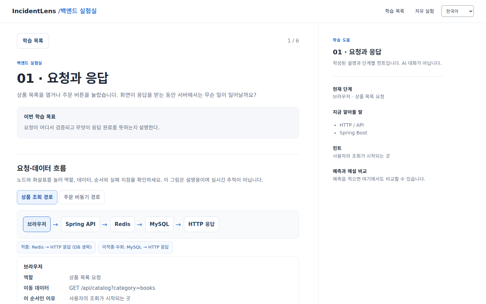
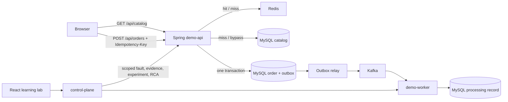

# IncidentLens

[English](README.md) · [한국어](README.ko.md)

IncidentLens is a local backend learning lab. Follow a request and its data through real code, predict what a fault will change, run a scoped experiment, inspect evidence, remove the fault, and compare recovery. The lessons work without services; measurements require the local stack. There is no account or paid API requirement.



## Learning path

1. **Request and response:** HTTP/API and Spring Boot accept, validate and answer requests. An order response does not mean the worker has finished.
2. **Database and transactions:** MySQL persists orders. A transaction saves the order and outbox event together.
3. **Cache:** Redis serves repeated catalog reads; learn hits, misses, fallback and explicit bypass.
4. **Asynchronous work:** Kafka separates intake from the demo worker. Docker runs isolated components and k6 reproduces a specified workload.
5. **Outbox and deduplication:** the relay publishes after the DB commit; Kafka acknowledgement can precede a failed outbox update, so duplicate delivery remains possible. The worker deduplicates the event effect. This is not an end-to-end exactly-once guarantee.
6. **Diagnosis and recovery:** metrics show trends, logs record events, traces show spans, and RCA separates observations from hypotheses. The rule-based report is the default; a compatible LLM is optional.

Each technology explains the problem, an analogy, actual behavior, why it was chosen, its alternatives, failure symptoms, and the relevant code. Select a node or arrow in either flow to inspect its role and failure boundary. The IncidentLens logo returns to the learning home; **Continue learning** restores the last lesson. Predictions, selected scenario and session, and the home/lesson view persist across refreshes. The right panel contains written hints, not an AI chat.

## System flow



The worker demonstrates follow-up processing; it does **not** charge a card or arrange shipping. A single local MySQL instance hosts separate service databases. Faults are scoped to an incident ID, one is active at a time, and they expire after 15 minutes. [Architecture and failure boundaries](ARCHITECTURE.md) · [API reference](docs/API.md).

## Run locally

Requires Docker Engine/Desktop with Compose. From the repository root:

```bash
bash scripts/dev-up.sh
```

Open **http://localhost:3000** (or `WEB_PORT` from your local `.env`). Read a lesson, write a prediction, select one of the four faults, and create a session. The site shows service connectivity before enabling controls. `bash scripts/dev-down.sh` preserves named volumes. The first build downloads images and dependencies. For traces, searchable logs and Grafana, start with `bash scripts/dev-up.sh --observability`; these tools are optional for the core lesson.

For frontend development while the backend stack is running:

```bash
cd apps/web
npm ci
npm run dev
```

Open **http://localhost:5173**. `INCIDENTLENS_API_TARGET=http://127.0.0.1:18080 npm run dev` can point Vite's `/api` proxy at a different local control-plane port. With no backend, the lessons still render and the experiment controls explain that results are unavailable. `?view=lab` opens the existing expert incident lab directly. `?embed=1` hides IncidentLens navigation so a host menu can frame the module.

## Four controlled faults

| Fault | Scoped change | Evidence to check |
|---|---|---|
| Downstream delay | Delays a simulated inventory lookup during catalog reads; above 1,500 ms it times out | Request p95, timeout event, inventory span |
| Database degradation | Uses a less efficient catalog query **and bypasses cache** | DB query duration, logical DB loads, request p95 |
| Worker slowdown | Delays each order event before the worker transaction | Kafka consumer lag, processing events, retries |
| Cache bypass | Skips Redis reads and request coalescing for catalog lists | Cache hit rate, DB loads, request p95 |

The browser can create a session, enable/disable its fault, collect evidence, request RCA and prepare an experiment. **k6 runs in a terminal, never in the browser.** For a complete measured BEFORE/AFTER cycle, use the displayed command or, for example:

```bash
SCENARIO=CACHE_DEGRADATION VUS=2 DURATION_SECONDS=10 bash scripts/demo-compare.sh
```

The Bash runner requires `curl`, `jq` and Docker. It checks service health and an idle backlog, runs BEFORE with the fault active, generates RCA, disables the fault, then runs the same workload for AFTER. It has a cleanup trap. A PowerShell equivalent is `./scripts/demo-compare.ps1 -Scenario CACHE_DEGRADATION -Vus 2 -DurationSeconds 10`. Check the saved experiment in the **Experiments** view and the report in **Evidence & RCA** after refreshing. Never treat absent telemetry as zero or as proof of health. Compare workload settings, cache warmth, backlog and other traffic before attributing a change to one cause; the DB fault also bypasses cache.

## Language and evidence

Use **한국어 / English** in the header. Both languages cover lessons, diagrams, questions, hints, controls, errors and the existing dashboard. Switching languages keeps the lesson, inputs and selected experiment. Raw logs, source code, and previously generated RCA reports keep their original language; changing the UI does not translate them. Saved evidence carries its source, window, value and unit when available. RCA reports separate the observed evidence IDs, suspected cause, impact, actions and uncertainties. The optional compatible LLM response is limited to **65,536 bytes while receiving**; oversized or timed-out requests are cancelled and the rule-based report remains available. [HTTP boundary verification](docs/RCA_HTTP_VERIFICATION_2026-10-03.md).

## Verification and limits

The redesigned UI is covered by TypeScript/build, Vitest, and Playwright checks for lesson navigation, language persistence, desktop/mobile layout, keyboard controls, disconnected state and explicit fault actions. Java tests cover request, persistence and RCA boundaries. Current run details and limits: [learning verification](docs/LEARNING_VERIFICATION_2026-10-03.md). Earlier measured experiments remain dated evidence: [2026-10-01 publication audit](docs/PUBLICATION_AUDIT_2026-10-01.md) and [2026-10-03 RCA live verification](docs/RCA_LIVE_VERIFICATION_2026-10-03.md). Screenshots are local UI captures; browser fixture tests are not benchmark data.

The lab is a teaching service, not a production load or reliability claim. Shared lag gauges may include unrelated traffic; sampling windows and cache temperature can change comparisons. The optional Grafana/Tempo/Loki stack adds detail but does not replace checking the core evidence. The demo worker has no real payment or shipping integration.

## Reuse under 쉬었음.com

The module lives in [`apps/web/src/learning/`](apps/web/src/learning/): bilingual lesson and fault content in `content.ts`, interaction/API wiring in `LearningLab.tsx`, and design rules in `styles.css`. `App.tsx` connects it to the existing control-plane endpoints through `api.ts`. A host can mount the page with `?embed=1` and provide its own menu; it must route `/api` to a **separate local or safely controlled lab backend**. Do not point fault or load controls at a public production service.

Study/Community list caching and Todo notification queues are **hypothhetical candidates based on public features**, not claims about 쉬었음.com's internals. First measure repeated reads, DB p95, notification delay tolerance and duplicate risk. Direct DB reads or synchronous work are simpler until those measurements justify added infrastructure. This repository does not modify the 운영 site or team repository.

## Project map

`apps/demo-api` contains catalog, orders and outbox; `apps/demo-worker` consumes events; `apps/control-plane` owns sessions, faults, evidence, comparisons and RCA; `apps/web` is the learning UI and expert dashboard. `loadtest/` holds k6 workloads, `scripts/` local runners, `infra/` container configuration, and `docs/` design and verification records. See [web development notes](apps/web/README.md) and [operations](docs/OPERATIONS.md) if present.
