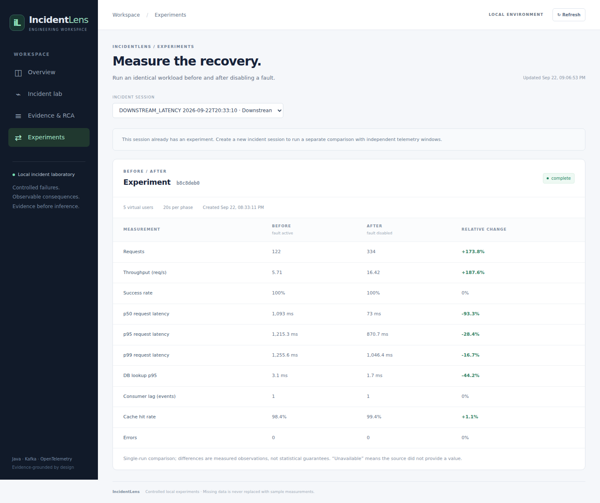
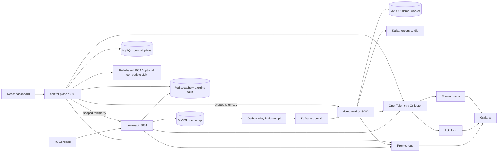

# IncidentLens

**Evidence-grounded AI incident analysis for distributed backend systems.**

IncidentLens is a local incident laboratory: generate traffic, introduce a controlled failure, collect explainable evidence, form a root-cause hypothesis, remove the fault, and compare the same workload again. The useful artifact is a reproducible experiment with citations—not a chatbot conversation.

The project explores a common backend problem: the request returned successfully, but asynchronous work is late, caches are ineffective, or database round trips dominate latency. A metric alone rarely identifies the cause. IncidentLens combines explicit business consistency, bounded telemetry, fault history, and measured comparisons so those explanations can be challenged.



Screenshots use English. The dashboard now defaults to Korean; select **한국어 / English** at the top right, and the browser remembers your choice. [Localization details](apps/web/README.md#korean--english-ui).

Actual local measurements, not sample dashboard data. [Capture provenance](apps/web/screenshots/live-capture.json) · [Evidence-grounded report](apps/web/screenshots/rca-live.png).

## Run it

Prerequisites: Windows 11, PowerShell, Git and running Docker Desktop with Linux containers / Compose. Building inside Docker does not require a host Java installation. Local development/test commands additionally require Java 21 and Node.js 22. Bash equivalents require `curl` and `jq`.

From the repository root:

```powershell
.\scripts\dev-up.ps1
.\scripts\demo-compare.ps1 -Scenario DOWNSTREAM_LATENCY -Vus 2 -DurationSeconds 10 -Parameter 1200
```

Open **http://localhost:3000**. Select the created incident to inspect evidence, the RCA report and the BEFORE/AFTER comparison. `dev-up` creates an ignored `.env` from `.env.example`, builds images, and waits for health checks. The first run downloads dependencies and images.

If Windows reserves these ports, set `WEB_PORT` and `GRAFANA_PORT` in `.env`; startup prints the actual URLs. This workspace uses **13000 / 13001** because Windows reserved the default range.

For traces, searchable logs and dashboards:

```powershell
.\scripts\dev-up.ps1 -Observability
```

Grafana: **http://localhost:3001** (`admin`, password from `GRAFANA_ADMIN_PASSWORD` in `.env`). API documentation: **http://localhost:8080/swagger-ui/index.html** and **http://localhost:8081/swagger-ui/index.html**. Prometheus: **http://localhost:9090** with the observability profile.

Linux/macOS:

```bash
bash scripts/dev-up.sh --observability
VUS=2 DURATION_SECONDS=10 PARAMETER=1200 bash scripts/demo-compare.sh --scenario DOWNSTREAM_LATENCY
```

Core planning budget: approximately 6 GB available to Docker; allow 8 GB for observability and additional headroom during image builds. These are planning estimates, not measured minimum requirements. `dev-down.ps1` / `dev-down.sh` preserve named volumes. `docker compose down -v` deliberately deletes local data.

## Architecture



Three applications reflect three failure/ownership boundaries. The control plane is independent of the failing workload; the API accepts orders; the worker demonstrates asynchronous processing and consumer lag. `libs/common` contains narrow event/context/telemetry contracts and HTTP safeguards. It is not another service. One MySQL instance hosts three databases for an affordable local demo; services do not read each other's business tables.

| Component | Concrete purpose |
|---|---|
| Java 21, Spring Boot, Gradle | HTTP APIs, dependency injection, transaction boundaries, repeatable builds |
| Spring Data JPA + targeted JDBC | Entity reads and lifecycle persistence; explicit atomic upserts and outbox claiming where SQL semantics matter |
| MySQL 8.4 + Flyway | Durable orders, deduplication, evidence and experiments; explicit constraints and indexes |
| Redis | Catalog caching and short-lived fault configuration |
| Kafka | Durable asynchronous order fulfillment, partitioning, lag, redelivery and DLQ demonstration |
| Micrometer / OpenTelemetry | Low-cardinality metrics and traces across HTTP, SQL, Redis and Kafka |
| React / TypeScript / Vite | An engineering dashboard with honest absent-data and failure states |
| k6 / Testcontainers / GitHub Actions | Repeatable load and failure-boundary verification |

See [ARCHITECTURE.md](ARCHITECTURE.md) for schemas, state transitions and failure reasoning.

## Request and event flow

1. `GET /api/catalog?category=books` takes the cache/query/downstream path.
2. `POST /api/orders` validates `Idempotency-Key` and order content.
3. A single MySQL transaction inserts the order and its outbox event. A repeated key with matching content returns the original order; conflicting content returns `409`.
4. The relay claims a due outbox row under a short database lock and publishes outside the transaction. Kafka acknowledgement precedes marking the row published.
5. The worker transaction records the event and fulfillment together. Duplicate deliveries are successful no-ops; conflicting reuse is rejected.
6. HTTP/session/correlation identifiers travel in the event. W3C trace context is persisted through the outbox and restored for Kafka publication.

**Why not save then publish?** A crash after the DB commit can permanently lose the event; publishing first can emit an order that later rolls back. The outbox makes the state change and the *intent to publish* atomic. A crash after Kafka acknowledgement can still cause duplicate publication, so the worker remains idempotent. This is at-least-once delivery with an idempotent business effect, not a claim of end-to-end exactly-once delivery. See [ADR 003](docs/adr/003-transactional-outbox.md).

## Four reproducible incidents

Faults apply only to requests/events carrying the selected incident ID. One fault owns the lab at a time, expires after 15 minutes, and can be disabled without rebuilding. Parameters are bounded.

| Scenario | Degraded behavior | Corrected behavior | Evidence to inspect |
|---|---|---|---|
| `DOWNSTREAM_LATENCY` | Inventory span delays catalog requests; above 1,500 ms hits a simulated timeout budget | Delay removed | Request p95/p99, timeout events, trace span |
| `DATABASE_DEGRADATION` | Non-sargable category expression plus 50 separate detail reads; cache bypassed | Indexed join, Redis caching | Catalog database lookup duration, SQL spans, logical DB loads |
| `KAFKA_SLOWDOWN` | Worker delays processing each event before its transaction | Delay removed and backlog drains | Committed-offset lag, fulfillment events, retry metrics |
| `CACHE_DEGRADATION` | Every catalog request bypasses Redis and coalescing | Cache + per-category local lock + 25–35 second TTL jitter | Cache hit ratio, database loads, request latency |

```powershell
.\scripts\demo-compare.ps1 -Scenario DATABASE_DEGRADATION -Vus 5 -DurationSeconds 20
.\scripts\demo-compare.ps1 -Scenario KAFKA_SLOWDOWN -Parameter 2000 -Vus 10 -DurationSeconds 20 -RecoverySeconds 20
.\scripts\demo-compare.ps1 -Scenario CACHE_DEGRADATION -Vus 5 -DurationSeconds 20
```

The DB experiment changes query behavior **and** cache use; total request improvement cannot be attributed solely to indexing. Inspect measured database lookup durations or design a separate SQL-only benchmark. The lower-case predicate cannot use the category lookup in the same way; `ORDER BY ... LIMIT 50` may still limit scanned rows. Do not claim every request scans all 10,000 catalog entries.

## Evidence and RCA

The control plane obtains bounded session/phase telemetry directly from the two demo services. This makes evidence collection usable without the heavier observability profile. Each durable evidence item includes an ID, timestamp/window, service, source endpoint, type, measured value/unit when present, optional trace reference, explanation and experiment phase. Unavailable telemetry becomes an explicit collection-gap event; it is never substituted with zero.

The deterministic provider produces hypotheses from latency, database duration, lag, cache behavior and recorded fault events. Its output separates summary, hypothesis, impact, citations, actions and uncertainties. Confidence is explicitly a heuristic, not a calibrated probability. A lack of observed traffic results in an insufficient-evidence report.

Optional compatible LLM configuration:

```dotenv
RCA_BASE_URL=https://your-compatible-provider.example/v1
RCA_API_KEY=
RCA_MODEL=
```

Set a real key only in the ignored `.env`. The adapter is enabled only when both key and model are present. It sends a bounded structured evidence package, not arbitrary raw logs. The response must satisfy the local schema, confidence bounds and known-ID citation checks. Timeout, malformed JSON, unknown citations or provider errors fall back to rules. Citation validation cannot prove that a semantic claim is true; reviewing the evidence remains necessary. [Provider design](docs/adr/005-grounded-rca.md).

## BEFORE vs AFTER

The runner first waits for an idle outbox and consumer group, then creates an incident and one experiment, activates the fault, runs BEFORE, stores its measured summary/evidence, creates the RCA, disables the fault, waits for recovery, and runs AFTER with the persisted VU count and duration. Both runs use the same catalog/order workload. The API rejects changed workload settings, invalid percentiles, repeated completion and out-of-order phases.

To use the dashboard workflow, create a fresh incident in Incident Lab, prepare its experiment in Experiments, and execute the displayed PowerShell command locally (Bash equivalents are documented in `loadtest/README.md`). The generated command includes the latest enabled fault parameter for that session, or 400 ms when no activation exists. Edit `-Parameter` to choose a different delay; the Bash runner uses `PARAMETER`. Prepare the experiment before sending manual traffic labelled BEFORE/AFTER: already-used scopes are rejected to prevent measurement contamination. The browser displays and controls experiments; k6 runs through the supplied command.

The dashboard compares throughput, success rate, p50/p95/p99, errors, database lookup p95, Kafka lag and cache hit rate where available. Raw k6 summaries are stored in ignored `artifacts/`; experiment results/evidence are durable in MySQL. The lab uses a database lease to prevent overlapping controlled runs. Emergency fault disable aborts an active run. Interrupted runs should be replaced by a new session rather than mixed into old histograms.

A fixed-VU workload has feedback: slow requests reduce offered throughput. The default recovery wait does not guarantee a drained backlog. Warm caches, JIT, dataset growth and asynchronous carryover are documented confounders. No production capacity or user-volume claims are made. [Load protocol](loadtest/README.md) · [Recorded measurements](docs/results/README.md).

## Recorded local results

One 20-second run per phase, Windows 11 / Docker Desktop, 8 vCPU and approximately 8 GB Docker memory. Five VUs except Kafka (10); observability export disabled during timing. All eight measured phases returned zero HTTP errors.

| Scenario | BEFORE → AFTER observation | Interpretation |
|---|---|---|
| Downstream latency, 1,200 ms delay | Mixed HTTP p95: 1,215.30 → 870.74 ms | Catalog route p95: 1,252.65 → 12.49 ms; the order route still contributes latency |
| Database degradation | DB lookup p95: 39.80 → 1.42 ms | Mixed HTTP p95: 929.70 → 941.58 ms; no overall p95 improvement demonstrated |
| Cache degradation | Logical DB loads: 147 → 1; cache hit rate: 0 → 99.3% | Throughput: 14.30 → 14.14 req/s; no throughput improvement demonstrated |
| Kafka slowdown, 2,000 ms delay | Sampled lag grew from 0 to a peak of 6; phase snapshots: 3 → 1 | Scoped consumer-delay evidence confirms injection; outbox backlog also limits delivery |

After draining the runs, the database check found 1,482 accepted orders and 1,482 fulfillments, with zero unpublished outbox rows. These are demonstrations, not isolated capacity estimates. Raw summaries, per-route timings, provenance and recovery checks live in [recorded results](docs/results/README.md). The outbox bottleneck prompted a separate RCA rule and queue-idle checks before subsequent experiments.

## Observability

The optional profile provisions Prometheus, Grafana, Loki, Tempo and the OTel Collector. Micrometer exports request/error counts, histogram latency, JVM, connection-pool, Kafka and business metrics. Grafana includes throughput, error fraction, p95/p99, heap/GC, DB pool, cache, outbox and Kafka lag panels, plus a fault timeline.

Structured logs include timestamp, level, service and available correlation/incident/trace context. Trace IDs are recorded only when an actual valid context exists. Core mode can retain context identifiers while export is disabled; an identifier alone does not prove the trace is stored in Tempo. The OTel agent instruments real HTTP/JDBC/Redis/Kafka operations; explicit context persistence bridges the outbox's asynchronous boundary. Logs and traces travel over OTLP, with no Docker socket mounted into the collector. See [infra/README.md](infra/README.md).

## Verification and tests

```powershell
.\scripts\verify.ps1 -Integration
```

```bash
bash scripts/verify.sh --integration
```

This checks required files, Gradle build/tests, infrastructure integration tests, frontend tests/build and all Compose profiles. Without `-Integration` / `--integration`, Docker-backed tests are excluded deliberately. Explicit integration execution fails if Docker is unavailable; it does not silently skip the suite.

- Unit tests: evidence provenance, insufficient evidence, RCA citations/fallback, invalid experiment summaries, fault behavior, cache coalescing, event validation and bounded bodies.
- Local application tests: real Spring HTTP + Flyway + database lifecycle with H2, labelled as wiring/behavior checks rather than MySQL proof.
- Testcontainers: actual MySQL constraints/transactions and concurrent idempotency; Kafka outbox publication, consumer redelivery and malformed-event DLQ behavior.
- Frontend: API failures, absent metrics, fault ownership, citations, comparisons and browser interactions.
- CI: build/test, Docker image build, full Compose startup and a degraded/recovered experiment; no LLM key or paid service needed.

Executed locally: **35 backend unit/application tests, 15 real-container integration tests, 27 frontend tests and 8 browser tests passed**. The complete PowerShell verification script passed under WSL with PowerShell 7. See [validation evidence](docs/VALIDATION.md) for commands and [SESSION_STATE.md](SESSION_STATE.md) for the current environment. Synthetic test fixture values are not benchmark results.

## Tradeoffs and limitations

This is an intentionally local, single-broker laboratory. There is no authentication or tenant boundary; ports bind to loopback. Do not expose fault-control endpoints publicly. TLS, separate DB credentials, authorization and audit hardening are deployment work. Catalog locks coalesce only within one API process. Fault control uses Redis plus a SQL audit log without a distributed transaction; Redis is authoritative for actual activation, and expiry/fail-open behavior bounds orphaned faults. A crash between those writes can leave an audit gap.

Scoped telemetry is bounded in memory (128 scopes, latest 8,192 duration samples), resets on restart and is not a durable replacement for Prometheus. Collected evidence is durable. Kafka lag/outbox backlog are shared gauges and may include other traffic. Data/outbox/dedup history needs retention before long-running production use. LLM citations reduce unsupported output but do not mathematically guarantee causal accuracy. No Resilience4j circuit breaker is added around a fake remote service; bounded budgets/retries exist where they have actual behavior to protect.

Future work should start with retention, authenticated fault controls, isolated repeated benchmark runs and automated trace-path assertions; CDC outbox relay or multiple replicas would follow measured need. Kubernetes, multi-region deployment and Terraform are intentionally outside the local core.

## Study before an interview

- [Interview guide](docs/INTERVIEW_GUIDE.md): consistency, concurrency, Kafka/Redis, observability and scaling questions.
- [Engineering story](docs/PROJECT_STORY.md): problem → failure mode → decision → evidence → tradeoff.
- [Architecture decisions](docs/adr/001-service-boundaries.md): alternatives and downsides, not a technology checklist.
- [AI engineering record](docs/AI_ENGINEERING.md): what was generated and how it was reviewed/tested.
- [AWS deployment design](docs/AWS_DEPLOYMENT.md): a proposed mapping; no cloud resources are provisioned.
- [API examples](docs/API.md) and [operations](docs/OPERATIONS.md).
