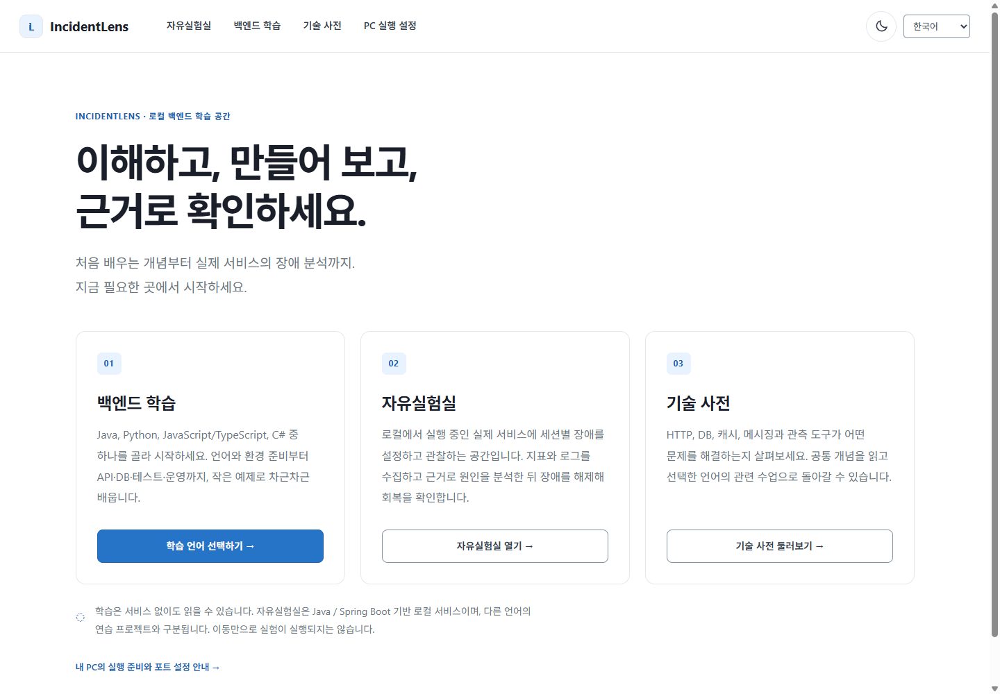
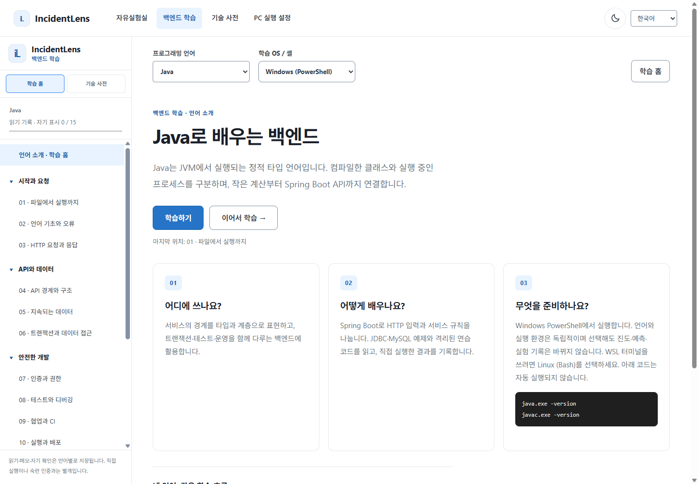
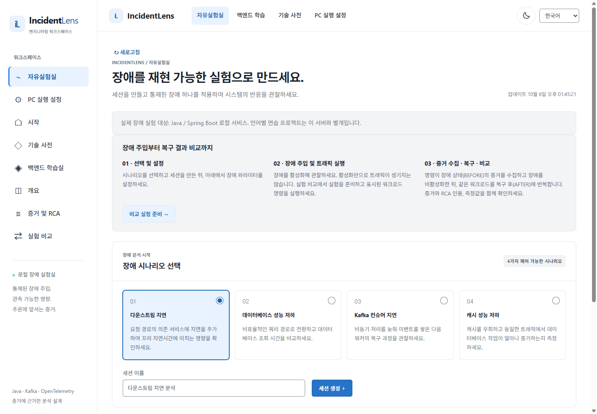
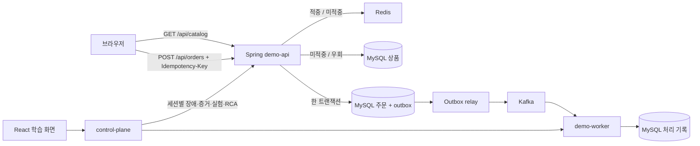

# IncidentLens

[한국어](README.md) · [English](README.en.md)

IncidentLens는 로컬에서 실행하는 백엔드 학습 실험실입니다. 실제 코드를 따라 요청과 데이터의 이동을 살피고, 장애 결과를 예측한 뒤, 선택한 세션에만 장애를 적용합니다. 증거를 읽고 장애를 해제해 회복을 비교합니다. 서비스를 켜지 않아도 개념 학습은 가능하며, 실측에는 로컬 스택이 필요합니다. 계정이나 유료 API는 필수가 아닙니다.

통합 홈에서 **백엔드 학습 · 자유실험실 · 기술 사전**으로 진입합니다. 네 언어는 같은 소개 → 학습하기 → 15단계 수업 구조를 사용합니다. 언어 변경은 소개 화면으로 돌아가며, 이어서 학습은 해당 언어의 마지막 단계를 복원합니다. 로고는 통합 홈, 별도 학습 홈 버튼은 언어 소개로 이동합니다. 테마는 해·달 버튼으로 라이트/다크를 바로 전환합니다.





위 이미지는 이번 코드의 실제 한국어 브라우저 화면(1440×1000, 라이트, Windows/PowerShell, Java 선택)입니다. 로컬에 저장된 테스트 세션은 실제 기록이지만, 화면 캡처는 새로운 부하 실측·성능 비교 결과가 아닙니다. 과거 UI 이미지를 새 결과로 재사용하지 않았습니다.

## 학습 순서

1. **요청과 응답:** HTTP/API와 Spring Boot가 요청을 접수·검증하고 응답합니다. 주문 응답 성공은 worker의 후속 처리 완료를 뜻하지 않습니다.
2. **DB와 트랜잭션:** MySQL에 주문을 지속 저장합니다. 주문과 outbox 이벤트는 한 트랜잭션에 기록합니다.
3. **캐시:** Redis가 반복 상품 조회를 줄입니다. 적중·미적중·대체 조회·명시적 우회를 구별합니다.
4. **비동기 처리:** Kafka가 접수와 데모 worker의 처리를 분리합니다. Docker가 구성요소를 나눠 실행하고 k6가 정해진 부하를 재현합니다.
5. **Outbox와 중복 방지:** relay는 DB 커밋 뒤 발행합니다. Kafka가 받은 뒤 outbox 완료 표시가 실패하면 중복 전송될 수 있어 worker가 이벤트 효과의 중복을 막습니다. 종단 간 exactly-once 보장은 아닙니다.
6. **장애 분석과 회복:** 지표는 추세, 로그는 사건, 추적은 요청 구간을 보여줍니다. RCA는 관찰과 가설을 분리합니다. 규칙 보고서가 기본이고 호환 LLM은 선택 사항입니다.

각 기술은 문제 상황, 쉬운 비유, 실제 동작, 선택 이유, 단점과 대안, 장애 증상, 관련 코드 순서로 설명합니다. 두 흐름도의 노드와 화살표를 누르면 역할과 실패 경계를 볼 수 있습니다. IncidentLens 로고를 누르면 통합 홈으로 돌아가고 별도 학습 홈에서 **이어서 학습**은 마지막 학습을 엽니다. 예측 메모, 선택한 장애·세션, 홈/학습 화면 상태는 새로고침 후에도 보존됩니다. 오른쪽 도움은 작성된 힌트이며 AI 채팅이 아닙니다.

## 전체 흐름



worker는 후속 처리를 시연할 뿐 실제 카드 결제나 배송을 하지 않습니다. 하나의 로컬 MySQL 인스턴스 안에 서비스별 DB가 분리되어 있습니다. 장애는 세션 ID에만 적용되고 동시에 하나만 활성화되며 15분 뒤 만료됩니다. [구조와 실패 경계](ARCHITECTURE.md) · [API 문서](docs/API.md).


## PC별 실행 설정

[PC 실행 설정 화면](http://localhost:3000/?view=settings)은 준비안을 브라우저에만 저장합니다. 선택만으로 Docker·`.env`·실험 부하가 변경되지 않습니다. 아래 명령을 직접 적용해야 하며, 포트 충돌은 기존 프로세스를 끄는 대신 `.env`의 호스트 포트로 조정하세요.

| 방식 | 필요한 구성 | 기능 제한 |
|---|---|---|
| 학습만 | Node.js 22 이상, 웹 개발 서버 | 수업·기술 사전·브라우저 기록. 실험 API 연결 차단, 장애·근거·RCA·k6 비교 없음 |
| 기본 실험실 | Docker/Compose, web·control-plane·demo-api·demo-worker·MySQL·Redis·Kafka | 세션별 장애·내장 계측·무료 규칙 RCA. 비교는 터미널 k6 실행. 검색 로그·trace·Grafana 없음 |
| 관측 도구 포함 | 기본 7개 + Prometheus·Grafana·Loki·Tempo·Collector | 상세 지표·로그·추적 추가. 더 많은 메모리·디스크·준비 시간 필요 |

학습만 실행할 때는 기존 Docker 서비스를 끄지 않습니다:

```bash
cd apps/web
npm ci
npm run dev -- --host 127.0.0.1 --port 5173 --mode learning
```

실험 API 프록시가 차단된 `http://127.0.0.1:5173`을 사용합니다. 설치되어 있지 않은 도구나 관리자·보안 설정 변경은 확인 후 수행하세요. Windows에서는 Docker Desktop의 현재 WSL 배포판 통합도 확인합니다.

`.env.example`을 새 `.env`로 복사하되 기존 `.env`는 덮어쓰지 않습니다. 호스트 바인딩은 항상 `127.0.0.1`입니다:

| 환경변수 | 기본 호스트 포트 | 고정 컨테이너 내부 포트 |
|---|---:|---:|
| `CONTROL_PLANE_PORT` | 8080 | 8080 |
| `DEMO_API_PORT` | 8081 | 8081 |
| `DEMO_WORKER_PORT` | 8082 | 8082 |
| `WEB_PORT` | 3000 | 8080 |
| `PROMETHEUS_PORT` | 9090 | 9090 |
| `GRAFANA_PORT` | 3001 | 3000 |

예를 들어 `CONTROL_PLANE_PORT=18080`으로 바꿔도 컨테이너끼리의 `control-plane:8080`, `demo-api:8081` 통신은 그대로입니다. 실행 후 `bash scripts/dev-status.sh` 또는 `./scripts/dev-status.ps1`이 실제 바인딩으로 상태와 주소를 확인합니다. Vite도 저장소 `.env`의 `CONTROL_PLANE_PORT`를 읽습니다. 변경한 포트·환경변수는 `dev-up`으로 해당 컨테이너를 재생성해야 적용됩니다. `docker compose restart`만으로 새 `.env`가 적용되지 않습니다. 프로필을 낮춰도 기존 관측 컨테이너를 자동 삭제하지 않습니다.

기본 부하는 **2 VUs, 단계별 10초**이며 허용 범위는 1–50 VUs, 5–300초입니다. 작은 부하부터 오류·대기열·`docker stats`를 관찰하세요. 최대 허용치는 PC 처리 능력의 보장이 아닙니다. 컨테이너 메모리 한도와 자원 확인 명령은 [PC 실행 안내](docs/PC_SETUP.md)에 있습니다. 약 6/8 GB의 Docker 가용 메모리는 계획용 추정치이며 실제 확인한 최소사양이 아닙니다. 저사양 정상 동작을 단정하지 않습니다.

새 비교 실행기는 로컬 Docker 컨텍스트·실제 바인딩·응답 인스턴스와 내부 장애 대상·k6 대상을 확인하고 불일치하면 세션·장애·부하 전에 중단합니다. `CONTROL_URL`만 다른 서버로 바꿔 원격 실험을 할 수 없습니다. 새 실행의 구성·부하·제어 실행 시간 구간·실측 경과 시간은 저장되며, 기존 미기록 값은 채워 넣지 않습니다. 다른 PC의 결과를 같은 조건의 성능으로 비교하지 마세요.

## 로컬 실행

Docker Engine/Desktop과 Compose가 필요합니다. 저장소 루트에서 실행합니다.

```bash
bash scripts/dev-up.sh
```

**http://localhost:3000** 또는 로컬 `.env`의 `WEB_PORT`를 엽니다. 학습을 읽고 예측을 적은 다음 네 장애 중 하나를 골라 세션을 만드세요. 화면에 서비스 연결 상태가 표시됩니다. `bash scripts/dev-down.sh`는 이름 있는 볼륨을 보존합니다. 첫 실행에서는 이미지와 의존성을 받습니다. 추적·검색 로그·Grafana가 필요하면 `bash scripts/dev-up.sh --observability`를 사용하세요. 이 관측 도구들은 기본 학습에 필수가 아닙니다.

백엔드 스택을 켜둔 채 프런트엔드를 개발할 때:

```bash
cd apps/web
npm ci
npm run dev
```

**http://localhost:5173**을 엽니다. 다른 로컬 컨트롤 플레인 포트는 `INCIDENTLENS_API_TARGET=http://127.0.0.1:18080 npm run dev`로 Vite의 `/api` 프록시를 지정할 수 있습니다. 백엔드가 없어도 학습은 보이며 실험 결과가 없음을 표시합니다. `?view=lab`은 기존 숙련자용 장애 실험실을 바로 열고, `?embed=1`은 호스트 사이트 메뉴를 위해 IncidentLens 내비게이션을 숨깁니다.

## 네 가지 통제 장애

| 장애 | 세션에 적용되는 변경 | 확인할 증거 |
|---|---|---|
| 외부 연동 지연 | 상품 조회의 재고 조회 시뮬레이션을 지연하며 1,500ms를 넘으면 시간 초과 | 요청 p95, timeout 이벤트, 재고 조회 추적 구간 |
| DB 비효율 | 비효율 상품 조회를 사용하고 **캐시도 우회** | DB 조회 시간, 논리적 DB 로드, 요청 p95 |
| worker 지연 | 주문 이벤트마다 worker 트랜잭션 전에 지연 | Kafka 소비 대기량, 처리 이벤트, 재시도 |
| 캐시 우회 | 상품 목록의 Redis 읽기와 요청 모으기를 건너뜀 | 캐시 적중률, DB 로드, 요청 p95 |

브라우저에서 세션 생성, 장애 설정·해제, 증거 수집, RCA 요청, 비교 실험 준비를 할 수 있습니다. **k6는 브라우저가 아닌 터미널에서 실행됩니다.** 완전한 BEFORE/AFTER 실측은 화면에 표시되는 명령 또는 다음 예시로 실행합니다.

```bash
SCENARIO=CACHE_DEGRADATION VUS=2 DURATION_SECONDS=10 bash scripts/demo-compare.sh
```

Bash 실행기에는 `curl`, `jq`, Docker가 필요합니다. 서비스 상태와 빈 대기열을 확인하고 장애 활성 상태의 BEFORE를 측정합니다. RCA를 생성하고 장애를 해제한 뒤 같은 부하로 AFTER를 측정하며 종료 시 정리도 시도합니다. PowerShell에서는 `./scripts/demo-compare.ps1 -Scenario CACHE_DEGRADATION -Vus 2 -DurationSeconds 10`을 사용합니다. 새로고침 후 **실험 비교**에서 저장 결과를, **증거 및 RCA**에서 보고서를 확인하세요. 미측정 값은 0이나 정상으로 간주하지 않습니다. 사용자 수·시간뿐 아니라 캐시 온도, 기존 대기량, 다른 트래픽도 확인해야 합니다. DB 장애는 캐시도 우회하므로 한 효과만의 성능 변화라고 해석하면 안 됩니다.

## 언어와 증거

상단의 **한국어 / English**로 전환합니다. 두 언어 모두 학습 본문, 흐름도, 질문, 힌트, 제어, 오류, 기존 대시보드를 포함합니다. 전환해도 위치·입력·선택한 실험은 유지됩니다. 원본 로그·코드·기존 RCA 보고서는 작성 언어 그대로 남으며 UI 전환으로 번역되지 않습니다. 저장 증거에는 출처, 시간 구간, 사용 가능한 경우 값·단위가 있습니다. RCA 보고서는 인용한 증거 ID, 추정 원인, 영향, 조치, 불확실성을 분리합니다. 선택적 호환 LLM의 응답은 **수신 중 65,536바이트로 제한**되며 초과나 시간 초과 시 취소하고 규칙 분석을 사용할 수 있습니다. [HTTP 경계 검증](docs/RCA_HTTP_VERIFICATION_2026-10-03.md).

## 검증과 한계

개편 화면은 TypeScript/빌드, Vitest, Playwright로 학습 이동, 언어 보존, 데스크톱·모바일 배치, 키보드, 연결 끊김, 명시적 장애 제어를 검증합니다. Java 테스트는 요청·저장·RCA 경계를 확인합니다. 이번 실행 결과와 제한은 [최종 UI·PC 설정 검증](docs/VALIDATION_20261006_UI.md)을 참고하세요. 이전 실측 결과는 당시 기록으로 남깁니다: [2026-10-01 공개 감사](docs/PUBLICATION_AUDIT_2026-10-01.md), [2026-10-03 RCA 실환경 검증](docs/RCA_LIVE_VERIFICATION_2026-10-03.md). 화면 캡처는 로컬 UI이며 브라우저 테스트의 fixture는 성능 실측이 아닙니다.

이 실험실은 학습용으로 운영 규모나 신뢰성을 보장하지 않습니다. 공유 lag 지표에는 다른 트래픽이 섞일 수 있고, 측정 시간창과 캐시 온도에 따라 비교가 달라집니다. 선택적 Grafana/Tempo/Loki는 상세 관측을 돕지만 기본 증거 점검을 대신하지 않습니다. 데모 worker에는 실제 결제·배송 연동이 없습니다.

## 프로젝트 구성

`apps/demo-api`는 상품·주문·outbox, `apps/demo-worker`는 이벤트 소비, `apps/control-plane`은 세션·장애·증거·비교·RCA를 담당합니다. `apps/web`은 학습 화면과 기존 대시보드입니다. `loadtest/`에 k6 부하, `scripts/`에 로컬 실행기, `infra/`에 컨테이너 설정, `docs/`에 설계·검증 기록이 있습니다. [웹 개발 안내](apps/web/README.md)와 [운영 문서](docs/OPERATIONS.md)도 참고하세요.

## 백엔드 학습실 완료 범위

Java·Python·JavaScript/TypeScript·C# 과정을 왼쪽 단계 목록(모바일 열기/닫기)에서 학습합니다. 언어 기초→HTTP/API→DB/트랜잭션→인증/권한→테스트→운영→캐시→동시성/중복→비동기→장애/복구를 실제 예제와 독립 과제로 연결합니다. [언어 예제](examples/language-paths/README.md), [학습 결과 지도](docs/BACKEND_LANGUAGE_PARITY.md), [실행 검증 기록](docs/VALIDATION_20261005.md)을 확인하세요. TypeScript는 고정 의존성으로 컴파일한 서버를 실제 실행합니다. SQLite·로컬 캐시·polling은 Redis/Kafka 검증으로 표시하지 않습니다.

언어별 진도·읽기·자기 확인과 학습/자유실험실 세션 선택을 분리하고 한영·OS·테마·새로고침·뒤로 가기를 유지합니다. 화면 이동은 장애 설정/해제나 RCA 재생성을 실행하지 않으며, 실제 활성 장애 경고는 계속 표시합니다. RCA는 SQL에서 BEFORE를 먼저 선택한 뒤 최신 500건을 제한합니다. 일반 증거에는 AFTER를 유지하고 저장된 보고서의 인용은 같은 세션에서 복원합니다.

확인 순서: 저장소에서 `cd apps/web`, `npm ci`, `npm run dev -- --host 127.0.0.1 --port 5173` → `http://127.0.0.1:5173` → 한영/OS/언어 선택 → 첫 수업 → 실습 기록 → 관련 기술 안내 → 준비됐을 때 자유실험실을 직접 선택합니다. 개발 서버의 API 프록시 기본값은 `http://127.0.0.1:8080`입니다. 실험실 연결이 없어도 수업은 읽을 수 있습니다.

이전 PC의 배포·DB 복구 기록은 당시 환경의 증거입니다. 현재 PC의 포트·기록으로 간주하지 않습니다: [당시 배포 기록](docs/MAIN_LOCAL_DEPLOYMENT_20261006.md), [당시 복구 기록](docs/LOCAL_BACKEND_RECOVERY_20261006.md).
