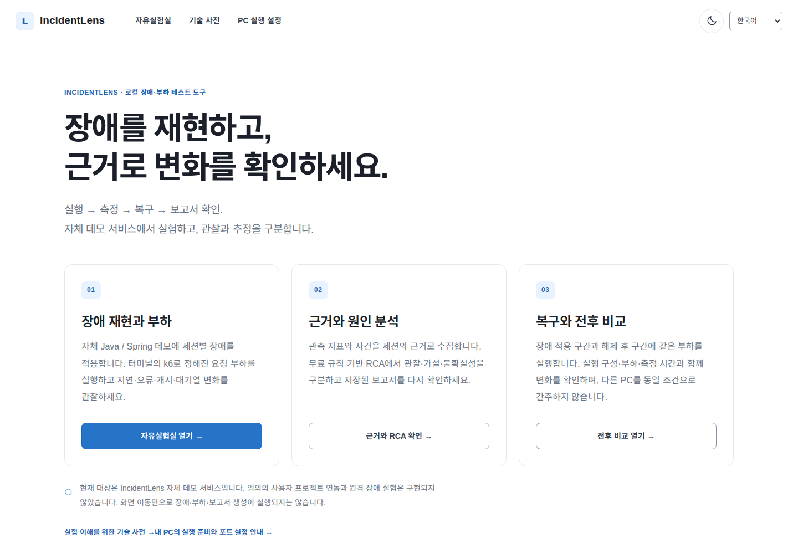
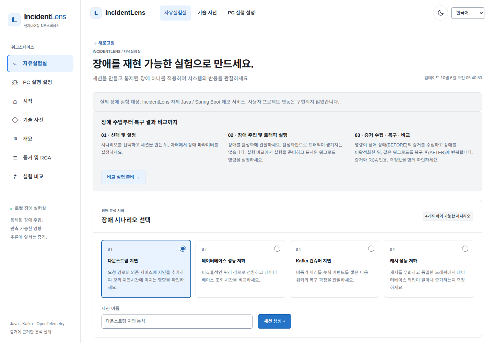
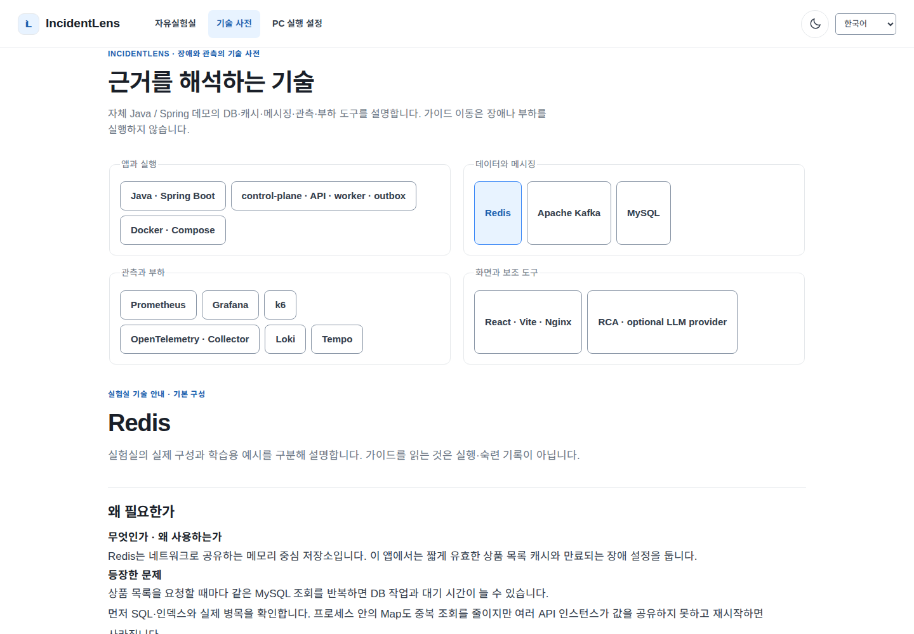
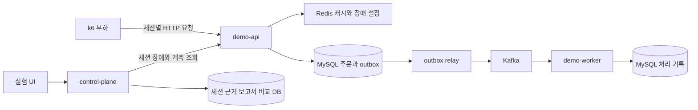

# IncidentLens

[한국어](README.md) · [English](README.en.md)

**백엔드 장애 재현·부하 테스트·관측·전후 비교·근거 기반 원인 분석**을 위한 로컬 도구입니다. 세션에 장애를 적용하고, 같은 요청 부하에서 무엇이 달라지는지 측정한 뒤, 장애를 해제해 회복을 비교합니다. 무료 규칙 기반 RCA가 관찰·가설·불확실성을 구분한 보고서를 저장합니다.

현재 실험 대상은 이 저장소의 **자체 Java / Spring Boot 데모 서비스**입니다. 임의의 사용자 프로젝트를 탐색·자동 분석하거나 연결하는 기능은 구현되지 않았습니다. 사용자 프로젝트 연동은 향후 계획이며, 이번 분리에 포함하지 않습니다. 원격 장애 실험도 지원하지 않습니다.





이번 소스의 실제 브라우저 화면을 한국어로 새로 캡처했습니다. 영어 문서는 별도의 영어 화면을 사용합니다. 모두 1440×1000·라이트입니다. 캡처는 화면 설명이며 성능·운영 실적을 증명하지 않습니다. 화면의 저장 세션은 실제 로컬 검증 기록이며 예시 측정 값을 넣지 않았습니다.

<a id="네-가지-통제-장애"></a>

## 장애 주입과 부하 테스트

**장애 주입**은 특정 세션의 요청·처리 경로에 지연이나 우회를 설정합니다. **부하 테스트**는 k6가 동시 사용자와 실행 시간에 따라 실제 요청을 보냅니다. 장애 설정만으로 부하가 시작되지는 않으며, 홈·메뉴·기술 설명 이동으로 실험을 실행하지 않습니다.

| 지원 시나리오 | 실제 데모 동작 | 주로 확인할 근거 |
|---|---|---|
| `DOWNSTREAM_LATENCY` | 주문의 재고 확인을 모사하는 downstream 경로에 지연 | HTTP 지연·오류·관련 사건 |
| `DATABASE_DEGRADATION` | 상품 조회의 비효율적인 DB 조회 경로 사용 | DB 작업·조회 p95·HTTP 지연 |
| `CACHE_DEGRADATION` | 상품 목록의 Redis 캐시·요청 합치기 우회 | 캐시 적중률·DB 작업·HTTP 지연 |
| `KAFKA_SLOWDOWN` | worker가 DB 트랜잭션 전 이벤트 처리를 지연 | consumer lag·처리 지연·대기열 |

이것은 네트워크 전체나 실제 DB/Kafka 프로세스를 파괴하는 도구가 아닙니다. 장애는 실험 세션 소유권과 헤더로 제한하고, 동시에 하나만 활성화하며 15분 후 만료합니다. 브라우저는 활성 장애 상태와 명시적인 해제·실험 복귀 버튼을 제공합니다. [데모의 실제 실패 경계](docs/DEMO_BACKEND.md).

## 실행 → 측정 → 복구 → 보고서 확인

1. 로컬 스택의 서비스 상태와 세션을 확인합니다. 자유실험실에서 시나리오를 골라 세션을 만들거나 기존 세션을 선택합니다.
2. 명시적으로 장애를 적용하고 요청을 보냅니다. 근거 화면에서 BEFORE/AFTER 구간을 선택해 수집할 수 있습니다. 자동 전후 비교는 아래 터미널 실행기를 사용합니다.
3. 비교 실행기는 대상 일치와 유휴 상태를 확인한 후 장애 적용 구간(BEFORE)에 k6 부하를 실행하고 근거·규칙 RCA를 저장합니다. 장애를 해제한 뒤 같은 부하를 AFTER 구간에 실행합니다. BEFORE는 무장애 baseline이 아니라 **장애 적용 구간**입니다.
4. 근거·RCA와 전후 비교에서 저장 결과를 확인합니다. 새로고침 후 같은 세션을 재조회할 수 있습니다. 실패한 실행은 완료된 성능 비교로 표시하지 않습니다.

```bash
VUS=2 DURATION_SECONDS=10 bash scripts/demo-compare.sh --scenario CACHE_DEGRADATION
```

```powershell
.\scripts\demo-compare.ps1 -Scenario CACHE_DEGRADATION -Vus 2 -DurationSeconds 10
```

Bash 실행기는 Docker·`curl`·`jq`가 필요합니다. k6는 Compose의 일회성 컨테이너로 실행합니다. 결과 JSON은 로컬 ignored `artifacts/`에 남고 세션·근거·보고서는 DB에 저장됩니다. 실행기는 실패·인터럽트 시 원래 로컬 인스턴스를 다시 확인하고 장애 해제를 시도합니다. 해제가 실패하면 원래 세션에서 수동 확인하세요. 실행을 중단할 때는 Ctrl+C를 사용하고 활성 장애가 남지 않았는지 확인합니다.

## 로컬 실행

Git, 로컬 Docker Engine/Desktop과 Docker Compose가 필요합니다. `.env.example`은 로컬 데모 기본값이며 규칙 RCA에는 계정·유료 LLM 키가 필요하지 않습니다. 기존 `.env`를 덮어쓰지 않습니다. 설치·관리자·보안 설정 변경이나 Docker 재시작이 필요하면 기존 컨테이너 영향을 먼저 확인하세요.

저장소 루트에서 실행합니다:

```bash
bash scripts/dev-up.sh
bash scripts/dev-status.sh
```

```powershell
.\scripts\dev-up.ps1
.\scripts\dev-status.ps1
```

기본 웹 주소는 **http://127.0.0.1:3000**, API 문서는 **http://127.0.0.1:8080/swagger-ui/index.html**입니다. 호스트 포트를 바꿨다면 `dev-status`가 출력한 실제 주소를 사용하세요. 기본 구성은 web·control-plane·demo-api·demo-worker·MySQL·Redis·Kafka 7개입니다. `bash scripts/dev-up.sh --observability` 또는 `.\scripts\dev-up.ps1 -Observability`는 Prometheus·Grafana·Loki·Tempo·OpenTelemetry Collector를 추가합니다. 최초 실행에는 이미지 다운로드·빌드 시간이 필요합니다.

## PC별 실행 설정

`?view=settings` 화면은 OS/셸·포트·부하 **준비안만 브라우저에 저장**합니다. Docker나 `.env`를 변경하지 않습니다. 실제 Docker/WSL 준비·예약 포트·RAM·디스크는 브라우저에서 확인할 수 없으며 터미널 명령으로 확인해야 합니다. [확인 명령·자원·적용 절차](docs/PC_SETUP.md).

| 사용 방식 | 기능과 제한 |
|---|---|
| 화면만 | Node.js 22.12 이상의 22.x 또는 24+와 웹 개발 서버. 홈·실험 화면·기술 설명을 읽지만 API 연결·장애·근거·RCA·비교는 불가 |
| 기본 실험실 | 기본 7개 서비스. 자체 데모 장애·내장 계측·규칙 RCA·터미널 k6 비교 |
| 관측 도구 포함 | 기본 + 관측 5개. 상세 지표·로그·분산 추적. 자원과 준비 시간 추가 |

화면만 실행: `cd apps/web`, `npm ci`, `npm run dev -- --host 127.0.0.1 --port 5173 --mode ui`. 기존 `--mode learning`은 API를 차단하는 호환 별칭이며 일반 학습 과정을 제공하지 않습니다.

| 환경변수 | 기본 호스트 포트 | 고정 컨테이너 포트 |
|---|---:|---:|
| `CONTROL_PLANE_PORT` | 8080 | 8080 |
| `DEMO_API_PORT` | 8081 | 8081 |
| `DEMO_WORKER_PORT` | 8082 | 8082 |
| `WEB_PORT` | 3000 | 8080 |
| `PROMETHEUS_PORT` | 9090 | 9090 |
| `GRAFANA_PORT` | 3001 | 3000 |

바인딩은 `127.0.0.1`입니다. 충돌 시 다른 프로세스를 종료하지 말고 `.env`에서 비어 있는 호스트 포트를 선택하세요. 컨테이너끼리의 내부 포트는 바뀌지 않습니다. Vite 프록시도 같은 루트 `.env`의 `CONTROL_PLANE_PORT`를 읽습니다. 환경변수·포트·프로필 변경 후에는 `dev-up`으로 관련 컨테이너를 재생성해야 적용됩니다. 단순 `restart`는 새 `.env`를 읽지 않습니다.

현재 고정 메모리 한도 합계는 기본 3.75 GiB, 관측 포함 6.25 GiB입니다. 이는 실제 사용량·최소사양이 아니며 OS·Docker·빌드·다른 컨테이너에 별도 여유가 필요합니다. 검증하지 않은 저사양 성공이나 최소 RAM을 단정하지 않습니다. 부하는 기본 2 VUs·단계별 10초, 허용 1–50 VUs·5–300초이며 최대값이 PC 처리 능력을 보장하지 않습니다. 작은 부하에서 `docker stats`, 오류와 대기열을 관찰하세요.

## 안전한 중지와 데이터 보존

장애를 해제하고 비교 실행이 끝났는지 확인한 다음 저장소 루트에서 `docker compose --profile observability stop`으로 중지합니다. 다시 `dev-up`을 실행해 시작할 수 있습니다. 같은 설정으로 중지된 컨테이너만 다시 시작할 때는 `docker compose --profile observability start`도 가능합니다.

`bash scripts/dev-down.sh` 또는 `.\scripts\dev-down.ps1`은 컨테이너·네트워크를 내리지만 이름 있는 볼륨을 보존합니다. 데이터 초기화·volume prune·system prune은 필요하지 않습니다. 관측 모드에서 기본 모드로 바꿔도 기존 관측 컨테이너는 자동 삭제하지 않습니다. 진단·실험 기록·`.env`는 Git에 넣지 않습니다.

<a id="언어와-증거"></a>

## 구현 범위와 한계

- 자체 데모의 세션·장애·근거·전후 비교·저장형 규칙 RCA·관련 기술 설명은 구현되어 있습니다. 규칙 결과는 가설이며 확률로 보정된 정확도나 확정 원인이 아닙니다. 증거가 없으면 확인 불가로 표시합니다.
- 기본 프로필의 계측과 선택 관측 도구는 다릅니다. 규칙 RCA가 기본이며 외부 호환 LLM은 명시적으로 키를 설정할 때만 선택합니다. 이번 검증에서는 유료 LLM을 호출하지 않았습니다.
- 비교 실행기는 Compose 바인딩·컨트롤 플레인 인스턴스·내부 장애 대상·k6 대상을 확인합니다. `CONTROL_URL`만 바꾸거나 원격 Docker를 사용해 대상이 달라지면 실행 전에 차단합니다.
- 실행 구성·부하·측정 시간은 새 실험에 저장합니다. 구성 해시는 동일한 하드웨어·트래픽·캐시 상태를 보장하지 않습니다. 다른 PC 결과를 같은 조건의 성능으로 비교하지 마세요.
- 사용자 프로젝트 연동은 **향후 계획**이며 자동 발견·분석·원격 주입 기능은 없습니다. 공개 서비스 배포와 운영 실적·저사양 성능 검증도 이번 작업에 포함하지 않습니다.

<a id="학습-순서"></a>
<a id="백엔드-학습실-완료-범위"></a>

## 학습 기능 분리

일반 Java/Python/JavaScript·TypeScript/C# 과정·진도·퀴즈·예제는 별도 **비공개** `NIGHTPURI/backend-learning` 저장소로 이동했습니다. 초대된 계정만 접근할 수 있으며 공개 이용 서비스로 제공하지 않습니다. 실험을 해석하는 DB·캐시·메시징·관측·부하·RCA 기술 설명은 여기 남아 있습니다.

기존 `?view=learn`은 분리 안내를 표시하며, 수업 기록을 삭제하지 않습니다. 기존 실험 직접 링크와 세션 선택은 유지합니다. 사이트 주소(origin)가 바뀌면 브라우저 진도가 자동 이전되지 않습니다. [기존 한국어 문서](README.ko.md)도 호환 진입점으로 유지합니다.

<a id="검증과-한계"></a>
<a id="프로젝트-구성"></a>

## 검증과 코드

분리 후 웹 빌드·단위 41개·브라우저 48개, 백엔드 단위 85개·통합 19개가 통과했습니다. 실제 별도 스택의 장애·부하·RCA 저장과 복구도 확인했습니다. 실행 결과만 [분리 검증 기록](docs/SPLIT_VALIDATION.md)에 기록합니다. 이전 통합 프로젝트의 테스트 개수를 현재 결과로 옮기지 않습니다. 화면/API fixture 테스트는 실측 성능 결과가 아닙니다. 관측 프로필 전체 기동과 저사양 검증은 이번 기본 스택 검증과 구분합니다.

프런트엔드 검증: `cd apps/web`에서 `npm ci`, `npm test`, `npm run build`, `npm run test:browser`. Java 21 백엔드 검증: 루트에서 `./gradlew build integrationTest --no-daemon`(통합 테스트는 Docker 필요). [구조](ARCHITECTURE.md) · [API](docs/API.md) · [운영](docs/OPERATIONS.md) · [보안](docs/SECURITY.md) · [웹 개발](apps/web/README.md).

## 전체 흐름



`apps/control-plane`은 제어·근거·보고서, `apps/demo-api`는 상품·주문·outbox, `apps/demo-worker`는 이벤트 후속 처리를 담당합니다. `apps/web`은 실험 화면, `loadtest/`는 k6 부하, `scripts/`는 로컬 실행·대상 검증, `infra/`는 컨테이너·관측 구성입니다. 실제 결제·배송을 수행하지 않으며 Kafka 접수는 worker 처리 완료가 아닙니다.
